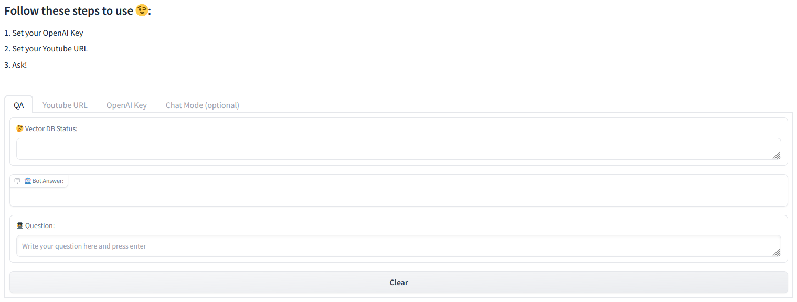
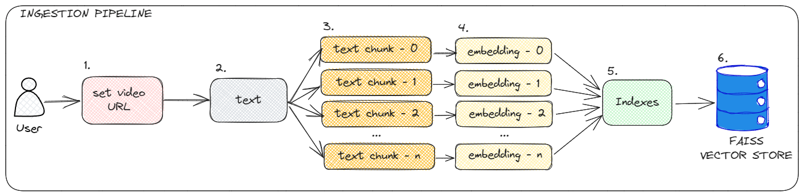
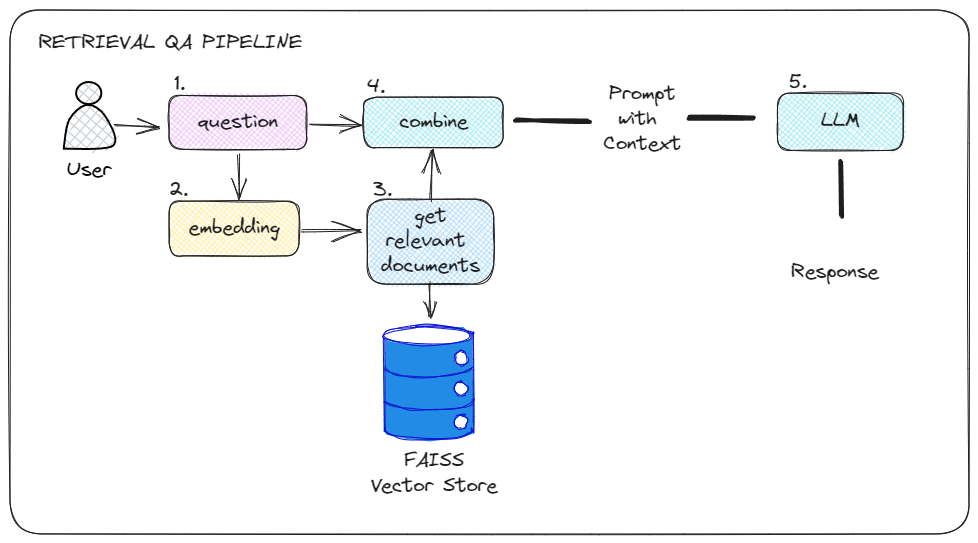
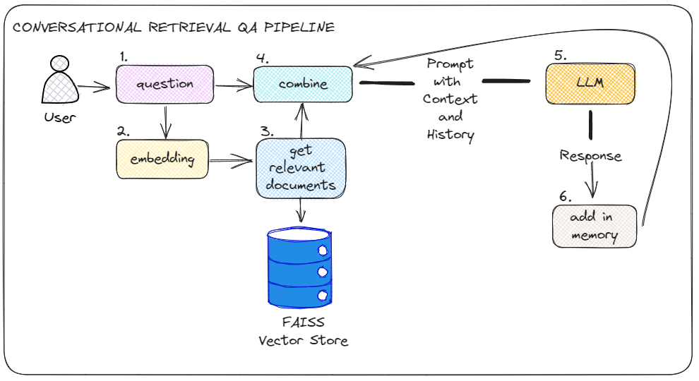

# Youtube Retrieval QA System

🤭 Hello, this article describes a work carried out in the postgraduate discipline Sequential Models taught by professor Ivanovitch Silva, and offered by PPGEEC/UFRN. It is part of my group Deborah Moreira and Miguel Euripedes.

By using this app you can ask ChatGPT questions about things in a video. To minimize the cost per token, we use a Vector Store to perform a semantic search and return the most related documents.

The architecture is divided into two parts, data ingestion and information retrieval to feed ChatGPT (LLM).

### Getting Started



#### HuggingFace Spaces

More simple: [run](https://huggingface.co/spaces/vilsonrodrigues/youtube-retrieval-qa)

#### Colab

Run notebook in <i>notebooks/YoutubeRetrievalQA.ipynb</i>

#### To local run

Install dependencies:

``` pip3 install -r requirements.txt ``` 

run Gradio app:

``` python3 app.py ``` 

### Architecture

[This](https.meulink) medium post detail the architecture. 

#### Ingestion

In short, in pipeline ingestion we have:



#### Retrieval QA 

To retrieval, the first option is stateless app



#### Conversational Retrieval QA 

The second option is a chain with memory object

